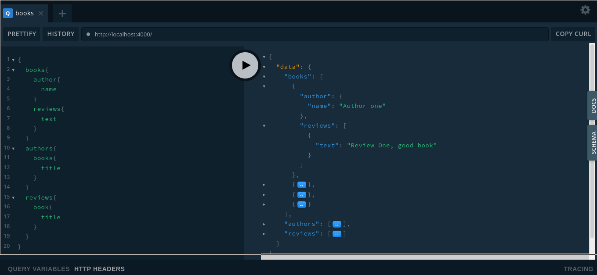

# GRAPHQL RELATIONS :rocket:

This is a graphql *practice*.  
Relacionando libros, autores y reviews.

## Technologies used for this project :computer:

- [graphql](https://graphql.org/)
- [graphql yoga](https://www.npmjs.com/package/graphql-yoga/v/0.1.0)
- [nodejs](https://nodejs.org/en/)

## Screenshots :camera:



## Hacking 

```cmd
git clone https://github.com/gabrielba15/ 
cd 
npm install  
npm run dev
```

> Ready, happy hacking :D
